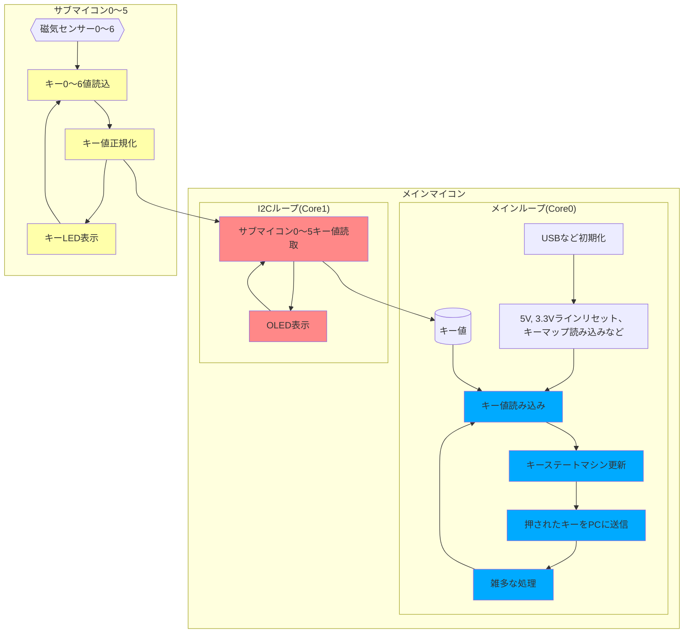

```mermaid
flowchart TB

subgraph "メインマイコン"
subgraph "メインループ(Core0)"
m-hardinit["USBなど初期化"]-->m-softinit
m-softinit["5V, 3.3Vラインリセット、キーマップ読み込みなど"]-->m-02
m-db[("キー値")]-->m-02["キー値読み込み"]
m-02-->m-03
m-03["キーステートマシン更新"]-->m-04
m-04["押されたキーをPCに送信"]-->m-05
m-05["雑多な処理"]-->m-02

style m-02 fill:#0af
style m-03 fill:#0af
style m-04 fill:#0af
style m-05 fill:#0af
end

subgraph "I2Cループ(Core1)"
i-01["サブマイコン0～5キー値読取"]-->i-02
i-01-->m-db
i-02["OLED表示"]-->i-01

style i-01 fill:#f88
style i-02 fill:#f88
end
end

subgraph "サブマイコン0～5"
s1-01["キー0～6値読込"]-->s1-02
s1-02["キー値正規化"]-->i-01
s1-02-->s1-03
s1-03["キーLED表示"]-->s1-01
s1-10{{"磁気センサー0～6"}}-->s1-01

style s1-01 fill:#ffa
style s1-02 fill:#ffa
style s1-03 fill:#ffa
end

```
